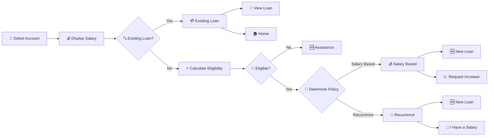

# 🤖 Instant-Loans
AI Instant Loans is a digital lending solution that uses transaction analysis 📊 and AI-based salary classification 🤖💰 to determine a customer's eligibility for an instant loan ⚡.

The solution analyses the customer's historical account transactions 🧾 to determine whether a regular salary is being received. The identified salary information is then used to determine which loan policy 📋 should be applied.

If a salary cannot be reliably identified 🔍, the customer is not necessarily rejected ❌. Instead, the system evaluates the customer against alternative loan policies, such as the Recurrence Policy 🔄, allowing eligible customers to access lending based on other patterns in their account activity.

The solution is accessed through the USSD channel 📱, providing customers with a simple and accessible way to apply for loans. The Virtual Service Center (VSC) 🎧 also plays an important role by providing support and assistance to customers who encounter issues or require help during the loan journey.

## 🚀 High-Level Loan Decision Flow
The AI Instant Loans journey is illustrated below.

